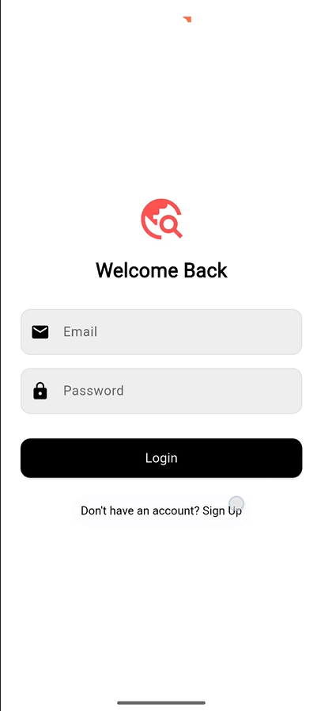
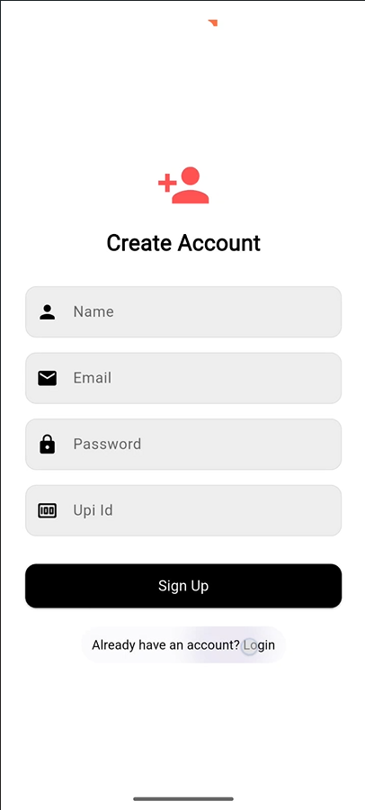
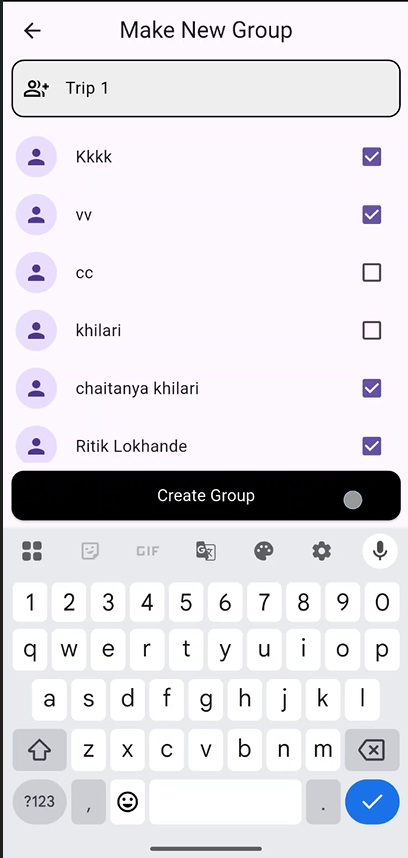
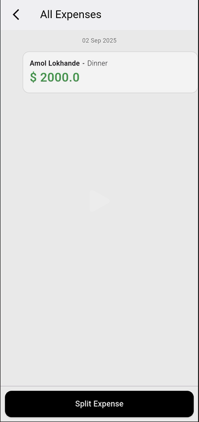
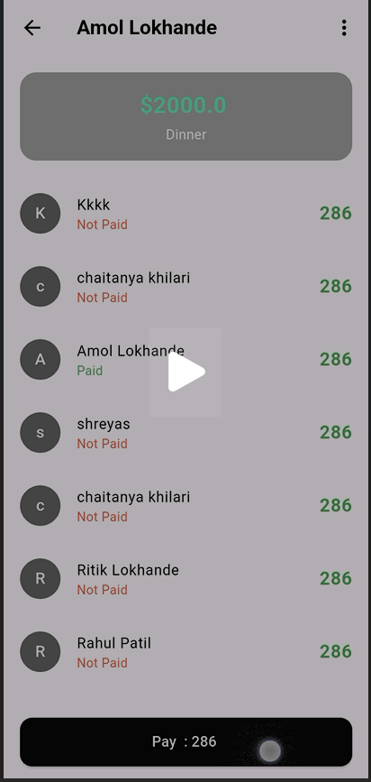

# 🌍 TravelHelper

A **Flutter Travel Companion App** built with **Flutter, Dart, Firebase, and Cloudinary**.  
TravelHelper makes trip planning easier with **group chat, expense splitting, image sharing, and real-time collaboration**.

---

## 🚀 Features
- 📱 **Group Chat** – Real-time communication between friends.
- 💰 **Expense Splitting** – Dynamic split calculations with UPI integration for payments.
- 🖼 **Image Sharing** – Upload and share trip photos using Cloudinary.
- 📅 **Trip Planning** – Create and manage travel groups with ease.
- 🔐 **Secure Auth** – Firebase Authentication for login and signup.
- ☁ **Cloud Storage** – Store photos and documents safely.

---

## 📸 App Screenshots

| Splash | Login | Signup | Create Group |
|--------|-------|--------|--------------|
|  |  |  |  |

| Chat | Chat List | Image Upload | Expense Split |
|------|-----------|--------------|---------------|
|  |  |  |  |

| Expense Split (Step 1) | Expense Split (Step 2) | Payment |
|-------------------------|-------------------------|---------|
|  |  |  |

---

## 🛠 Tech Stack
- **Frontend:** Flutter, Dart
- **Backend:** Firebase
- **Storage:** Cloudinary
- **Payments:** UPI Integration

---